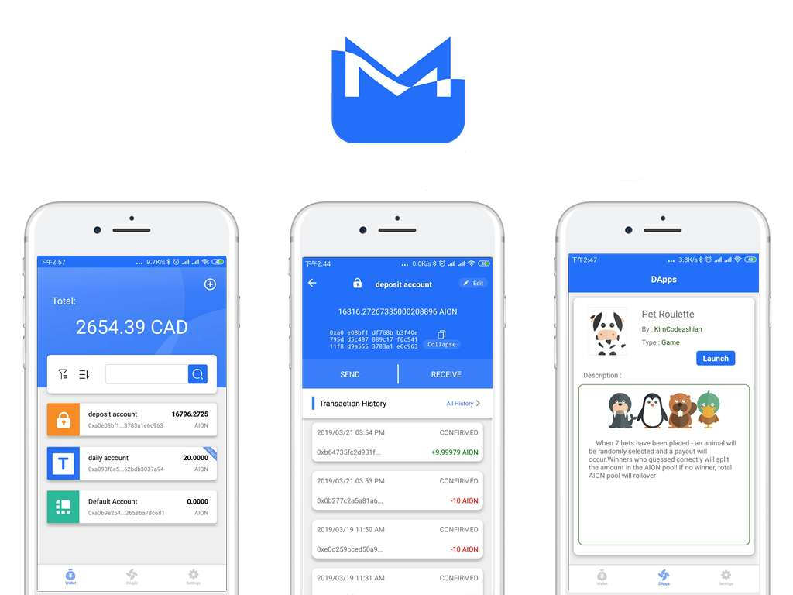

# Makkii Wallet

Welcome to Makkii Wallet! Makkii wallet is a secure, convenient and trusted Crypto asset management tool.

# Features
* Generate wallet for Aion(m/44'/425'/0'/0').
* Support Ledger
* Create, manage accounts.
* Send and receive transactions.
* View transaction history.
* Kyber DEX
* Blockchain News

# Prerequisites
* yarn or npm
* Android SDK(for android only)
* [React Native](https://facebook.github.io/react-native/docs/getting-started)

# Build
<pre>
$ git clone git clone https://github.com/chaion/wallet.git
$ cd wallet
$ yarn
$ yarn build-inject
# android debug
$ react-native run-android
# build android package, apk is generated under android/app/outputs/apk/release/app-release.apk
# follow the <a href=https://facebook.github.io/react-native/docs/signed-apk-android target="_blank">Generating Signed APK</a>
$ cd android; ./gradlew assembleRelease
</pre>

# Contact
To keep up to date by joing the following channels:

- [Chaion Forum](https://forum.chaion.net/)
- [Chaion Telegram](https://t.me/Chaion)

# License
Makkii is released under the [GPL-V3 License](LICENSE)
